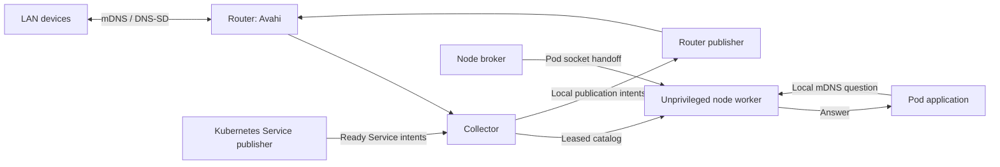

# Discovery Bridge

[](https://github.com/mikenorgate/discovery-bridge/actions/workflows/ci.yml)
[](LICENSE)

Discovery Bridge makes LAN mDNS and DNS-SD devices discoverable across routed
networks and inside Kubernetes pods. It also advertises selected Kubernetes
LoadBalancer Services on the LAN. Avahi handles LAN browsing, probing and
publication; Discovery Bridge supplies address policy, expiry and pod delivery.

Deploy one broker DaemonSet across Linux nodes and opt applications in through
pod labels and admission rules. A shared worker answers through sockets in each
admitted pod's network namespace, without a sidecar or a LAN interface. LAN queries
stay outside pods, and individual pods are never advertised.

```sh
avahi-browse --resolve --terminate _http._tcp
avahi-resolve-host-name example-device.local
discovery-bridge registry describe --locale de _http._tcp
```

## How it fits together



| Role | Placement | Responsibility |
| --- | --- | --- |
| `collector` | Host attached to each selected LAN | Observe devices, retain record expiry, serve the pod catalog and receive Service intents |
| `publisher` | Same host, with Avahi | Probe and publish admitted records on the selected LANs |
| `broker` | One DaemonSet pod per Linux node | Admit client pods and manage their responders |
| Responder | One unprivileged worker in each broker container | Answer through sockets opened in admitted pod namespaces |
| `kubernetes-publisher` | One Deployment replica | Read selected Services and EndpointSlices and send leased intents |

The collector and router publisher use separate locked accounts and a local
Unix socket. The broker starts its shared worker with UID/GID 65532 and no capabilities.
Run the Service publisher when you need Kubernetes Services advertised. A router
deployment can omit the pod gateway for LAN-only use.

## Install a release

[Releases](https://github.com/mikenorgate/discovery-bridge/releases) provide Linux
AMD64 and ARM64 binaries, Debian 13 packages, offline OCI archives, `SHA256SUMS`
and `release.json`. The public OCI image is
`ghcr.io/mikenorgate/discovery-bridge`. One image tag contains both architectures.
Deployment hosts do not need Go or a build toolchain.

### Debian router package

These commands use the GitHub CLI to download and verify release `v0.1.5` for
the router's architecture:

```sh
BRIDGE_VERSION=0.1.5
BRIDGE_ARCH=$(dpkg --print-architecture)
mkdir -p /tmp/discovery-bridge-install
cd /tmp/discovery-bridge-install
gh release download "v${BRIDGE_VERSION}" --repo mikenorgate/discovery-bridge \
  --pattern "discovery-bridge_${BRIDGE_VERSION}_${BRIDGE_ARCH}.deb" \
  --pattern SHA256SUMS --pattern release.json
sha256sum --ignore-missing --check SHA256SUMS
sudo apt install "./discovery-bridge_${BRIDGE_VERSION}_${BRIDGE_ARCH}.deb"
discovery-bridge version
```

Installation creates accounts, D-Bus policy, state files and systemd units.
It leaves Discovery Bridge disabled and installs no active router configuration.
Package upgrades preserve state and leave restart timing to the operator.

### Standalone binary and container

The binary archive is named
`discovery-bridge_<version>_linux_<amd64|arm64>.tar.gz`. Verify its checksum,
extract it into a staging directory and install `usr/bin/discovery-bridge`.
For router roles, also install the account definitions, D-Bus policy, tmpfiles
configuration and units described in [packaging](packaging/README.md).

The container includes `discovery-bridge`, `kubectl`, `crictl`, `ip` and CA
certificates. Its entrypoint is `/usr/bin/discovery-bridge`; its default command
prints the version. Kubernetes examples select the role through `args`.
Use the multi-architecture digest in `release.json` when pinning an image.

## Configure the router

Start from [router.json](packaging/examples/router.json) and
[avahi-daemon.conf](packaging/examples/avahi-daemon.conf). The examples use
documentation networks. Replace the addresses, interface names and client ranges
before enabling the services. From a checkout:

```sh
sudo install -d -m 0755 /etc/discovery-bridge
sudo install -m 0644 packaging/examples/router.json /etc/discovery-bridge/router.json
sudoedit /etc/discovery-bridge/router.json
```

| Field | Set it to |
| --- | --- |
| `enabled` | `true` after configuring the deployment |
| `interfaces` | Each LAN/VLAN interface, a unique source name and selected families (`4`, `6` or both) |
| `sources` | Admitted native address ranges per source; use a separate source for published Service VIPs |
| `forbidden` | Ranges that must never be advertised, including pod and backend networks |
| `alias_prefix` | A short lowercase prefix for persistent aliases used to disambiguate names |
| `bus_socket` | Local system D-Bus socket, normally `/run/dbus/system_bus_socket` |
| `state` | Persistent identity database, normally `/var/lib/discovery-bridge/identities.db` |
| `publisher_socket` | Local socket, normally `/run/discovery-bridge/publisher.sock` |
| `producer_user` | Collector account admitted to that socket; the package uses `discovery-bridge-collector` |
| `gateway` | Optional numeric HTTP bind address, port and admitted broker client ranges |
| `publication` | Optional separate HTTP listener, admitted Service producer ranges and VIP source name |
| `bootstrap` | Optional explicit `.local` browse questions; standard service enumeration runs without these |
| `translators` | Optional readiness configuration; see [translation](#address-translation) |

Keep source names and ranges identical in router and broker configurations.
The Service VIP source must not overlap LAN sources. Configuration is strict
JSON: unknown fields, duplicate fields and files larger than 64 KiB are rejected.
Listeners and gateway destinations require numeric unicast addresses.

### Avahi and network requirements

Merge the example settings into `/etc/avahi/avahi-daemon.conf`. Select the same
interfaces as `router.json` and enable the required IP families. Disable Avahi's
reflector: the router publisher supplies admitted records across LANs. Disable
automatic host, workstation and hardware advertisements while retaining
publication through D-Bus.

On each selected interface, allow incoming and outgoing UDP port 5353 for IPv4
`224.0.0.251` and IPv6 `ff02::fb`, plus unicast replies used by mDNS. Preserve
the IP TTL/hop limit of 255. Check IGMP/MLD and switch multicast filtering when
queries leave an interface but responses do not arrive. The host needs an
address and a working multicast route for every configured interface/family.
Application traffic follows your existing routing and firewall policy.

Allow TCP access to the catalog and publication listeners only from their
respective clients. These listeners use plain HTTP with source address admission;
they have no TLS or application credentials. Restrict access with router and
Kubernetes network policy. Use the source addresses the router actually sees,
including cluster SNAT, in `clients`. The publication listener grants publication
authority and should admit only its producer.

### State and systemd services

Keep `/var/lib/discovery-bridge` persistent. Package tmpfiles rules give both
router accounts group write access to the database and its SQLite WAL files.
The feed database is `identities.db.feed`. Preserve both databases during updates
to retain aliases, ownership and feed generation. Changing state or socket paths
also requires changing the units' writable paths and tmpfiles rules.

Add systemd drop-ins for your interface readiness dependencies. Once Avahi and
the selected interfaces are ready:

```sh
sudo systemctl restart avahi-daemon
sudo systemctl enable --now discovery-bridge-publisher.service
sudo systemctl enable --now discovery-bridge-collector.service
systemctl status discovery-bridge-publisher discovery-bridge-collector
journalctl -u discovery-bridge-collector -u discovery-bridge-publisher
```

The units bound runtime concurrency, memory and tasks, and use watchdogs for
recovery. Stop a previous publisher before replacing it. Roll back using the
matching binary, configuration and preserved state.

## Deploy to Kubernetes

The [manifest](packaging/examples/kubernetes.yaml) contains one broker DaemonSet,
one Service publisher Deployment and read-only RBAC. It uses the same image on
ARM64 and AMD64 nodes, including nodes with `NoSchedule` taints. The broker has a
Linux OS selector, with no architecture or named-node filter. The example assumes
a Linux containerd runtime and an IPv6-reachable router.

Prepare copies of:

- [broker.json](packaging/examples/broker.json): router endpoint, source policy,
  admission rules, runtime socket and host `/proc` mount.
- [services.json](packaging/examples/services.json): publication endpoint, VIP
  policy and explicit Service port selections.
- [kubeconfig.yaml](packaging/examples/kubeconfig.yaml): reachable HTTPS API
  endpoint; token and CA paths match the manifest's projected volumes.

Set `runtime_endpoint` and the DaemonSet's socket mount to your runtime's actual
path. K3s commonly uses `/run/k3s/containerd/containerd.sock`.
Set the API endpoint to one reachable from both components and covered by the
API certificate. Keep CA verification enabled.

From a checkout, after editing those files:

```sh
kubectl apply -f packaging/examples/kubernetes.yaml
kubectl -n discovery-bridge create configmap discovery-broker-config \
  --from-file=config.json=packaging/examples/broker.json \
  --from-file=kubeconfig=packaging/examples/kubeconfig.yaml \
  --dry-run=client -o yaml | kubectl apply -f -
kubectl -n discovery-bridge create configmap discovery-publications \
  --from-file=config.json=packaging/examples/services.json \
  --from-file=kubeconfig=packaging/examples/kubeconfig.yaml \
  --dry-run=client -o yaml | kubectl apply -f -
kubectl -n discovery-bridge rollout status daemonset/discovery-broker
kubectl -n discovery-bridge rollout status deployment/discovery-publisher
```

Pods wait for ConfigMaps between the first apply and their creation. For GitOps,
commit the rendered ConfigMaps and manifest together. For pod discovery alone,
omit the publisher Deployment, its ServiceAccount, Role/RoleBinding and
ConfigMap, and the router's `publication` listener.

The broker requires root with `SYS_ADMIN`, `SYS_PTRACE`, `SETUID` and `SETGID`,
host `/proc` and access to the runtime socket. The example uses an AppArmor
exception for that container, retaining capability limits, seccomp and a
read-only filesystem. A locally managed AppArmor profile must allow the same
namespace operations. The runtime socket remains privileged access even when
mounted read-only. Host networking and host PID mode are not required.

The publisher runs as UID/GID 65532 with no capabilities. Its RBAC permits `get`
on the selected Service and `list` on EndpointSlices in that namespace. Add a
Role/RoleBinding for each additional selected namespace. Restrict both components'
API and router egress through cluster network policy.

### Opt an application in

The broker requires **both** an opt-in pod label and a matching operator rule.
The example admits namespace `automation`, service account `discovery-client`
and label `app: home-automation`. Add these fields to the application's pod
template:

```yaml
spec:
  template:
    metadata:
      labels:
        app: home-automation
        discovery-bridge-client: "true"
    spec:
      serviceAccountName: discovery-client
```

The manifest provides that ServiceAccount. Adjust the rule when your app uses a
different one. Set `opt_in_key` to use a different opt-in label. Removing the
label or rule, terminating the pod or losing admission removes its responder.
No extra container or pod LAN attachment is needed.

Applications send mDNS queries on their normal pod interface (`eth0` by default).
Responders answer locally. LAN queries never enter the pod, and the pod does not
appear in LAN service enumeration. Applications must enable the pod's available
IP family: an IPv4-only mDNS client will not discover devices from an IPv6-only pod.

### Publish a Kubernetes Service

The example selects `automation/web`, named port `http`, type `_http._tcp` and
instance `Example web`. Supply a LoadBalancer Service with a VIP inside
`vip_networks` and ready EndpointSlices; the manifest does not create that app.
SRV records use the external Service port. Backend addresses, ClusterIPs and
pod addresses are withheld.

Each selection specifies `namespace`, `name`, named `port`, `type`, `instance`,
`txt` and `subtypes`. At most 16 selections and four VIPs per selection are
supported. The producer refreshes a 15-second lease every five seconds; readiness
loss or lease expiry withdraws records. Keep one producer replica and the
Deployment's `Recreate` strategy to avoid overlapping producers.

Hostnames use `kube-<uid hash>.local`; service instances include a UID suffix.
Records include type enumeration, PTR, SRV, TXT, A/AAAA and configured subtype
PTRs. [Service publication](docs/SERVICES.md) describes admission and naming.
Ingresses and NodePort Services are not publication sources.

### Configuration changes and image updates

Configuration is read at startup. After updating ConfigMaps, restart the affected
role:

```sh
kubectl -n discovery-bridge rollout restart daemonset/discovery-broker
kubectl -n discovery-bridge rollout restart deployment/discovery-publisher
```

Image changes trigger a rolling broker update, one node at a time, and a Recreate
publisher update. `IfNotPresent` works with immutable version tags and pinned
digests; containerd chooses the matching platform from the image index.

With Flux, create an ImageRepository for GHCR and an ImagePolicy that selects
your accepted version range and reflects its digest. Add the same setter marker
to both image fields:

```yaml
image: ghcr.io/mikenorgate/discovery-bridge:v0.1.5@sha256:f3c98a353602ad869708066c71a1f698f85125f0514197d16e82fd345c181157 # {"$imagepolicy": "flux-system:discovery-bridge"}
```

ImageUpdateAutomation commits updates to your deployment repository. Flux tag
policies do not consult the GitHub release's prerelease flag; gate the accepted
version range according to your rollout process. See the
[Flux image update guide](https://fluxcd.io/flux/guides/image-update/).

## Address translation

Native addresses take precedence. Optional NAT64 and NAT46 answers require
explicit ranges and a fresh readiness sample from existing TAYGA instances.
An IPv4 answer for an IPv6 target is returned **only when its NAT46 mapping
already exists**. Discovery Bridge never allocates mappings, starts translators
or changes their configuration.

Configure `translators` on the router and matching `translation` ranges on the
broker. [Translator configuration](docs/TRANSLATORS.md) describes profiles,
commands, routes and immutable TAYGA settings. Configure packet translation,
return routes and application access separately. The deployment examples contain
no translation configuration.

## Check discovery

From a LAN client:

```sh
avahi-browse --all --resolve --terminate
avahi-resolve-host-name example-device.local
```

For `ping`, `curl` and `ssh` to resolve `.local`, configure the client OS's mDNS
resolver. On Linux, use systemd-resolved's mDNS support or Avahi with the
appropriate NSS module. Check with `getent hosts example-device.local`.
Discovery Bridge does not install workstation resolver settings.

Inside an admitted pod, use the application's mDNS browser or a diagnostic tool
available in its image. Confirm device hostnames resolve and selected Services
have the expected SRV port and TXT values. Device access is a separate routing
and firewall check.

```sh
kubectl -n discovery-bridge get pods -o wide
kubectl -n discovery-bridge logs daemonset/discovery-broker --tail=50
kubectl -n discovery-bridge logs deployment/discovery-publisher --tail=50
```

| Symptom | Check |
| --- | --- |
| Broker Pending | CPU/memory requests, taints, admission policy and runtime socket path |
| Namespace permission error | Capabilities, AppArmor and host `/proc` access |
| No application responder | Opt-in label **and** namespace, service account and workload-label rule |
| LAN browse works, pod browse is empty | Gateway client ranges, reachability, source policy and application IP family |
| Devices missing from one VLAN | Interface/family selection, multicast filtering and UDP 5353 in both directions |
| Service absent | Named port, VIP range, RBAC and explicitly ready EndpointSlices |
| Translated address absent | Translator readiness, routes and existing NAT46 mapping |
| Records disappear during an outage | Expected expiry from wire TTLs and independent catalog/producer leases |

## Protocol support and limits

The catalog retains DNS-SD names, subtypes and opaque TXT values. Generated
service types follow RFC6335. Descriptions come from the embedded, pinned Avahi
Service Type DB and IANA data. Unknown valid observed types retain their raw
names. Original `.local` names are used where ownership is unambiguous;
persistent aliases handle conflicts between sources.

The bridge discovers records advertised through mDNS. It does not create DNS
names for silent DHCP/SLAAC clients or manage a conventional DNS zone. Admission,
expiry and bounded record budgets apply to native and derived answers.
The [compatibility contract](docs/CONTRACT.md) specifies these rules.

## Build and contribute

Source builds use **Go 1.27.1**, pinned in `go.mod`, `.go-version` and CI:

```sh
make test
make check
make build
dist/discovery-bridge version
```

`make test` runs unit tests with the race detector. `make check` runs source
checks, formatting checks and `go vet`. [Packaging](packaging/README.md) describes
native artifact and container builds.

Integration tests require root on disposable Linux hosts with `iproute2`,
`util-linux`, `dbus`, `avahi-daemon` and `ethtool`. Translator fixtures also need
`/dev/net/tun`. CI qualifies native AMD64 and ARM64 packages, systemd services,
real Avahi and namespace behavior, and the exact released container roles.
Translator fixtures check readiness against real interfaces and routes; they
do not test packet NAT. [Worker measurements](docs/PERFORMANCE.md) document the
measured workload and resource costs.

Open an issue or pull request with the affected role, version, sanitized
configuration and reproduction steps. Keep deployment inventories and captured
traffic in the operator's infrastructure repository.

## License

Project source uses the [MIT license](LICENSE). Embedded registry data retain
their [upstream notices](registry/COPYING.avahi).
